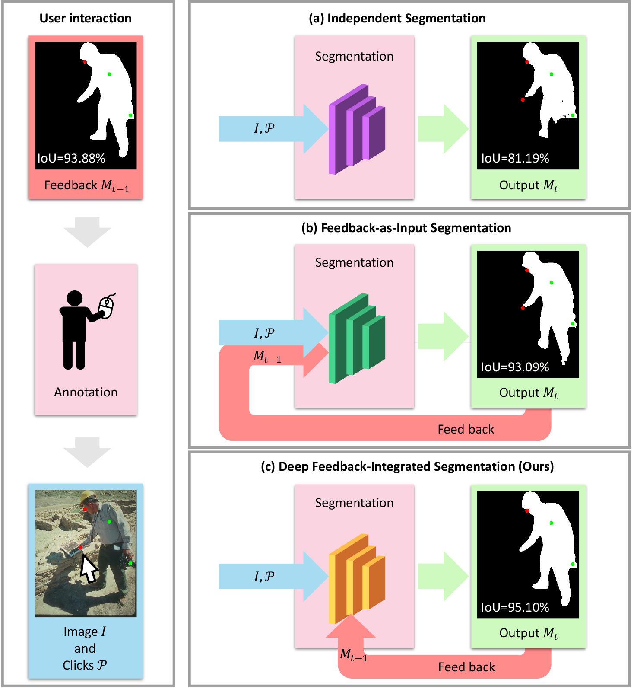

# FCFI
The official implementation of paper "Focused and Collaborative Feedback Integration for Interactive Image Segmentation" in CVPR2023.

Coming soon!
## Introduction
<div align=center></div>

**Abstract.** Interactive image segmentation aims at obtaining a segmentation mask for an image using simple user annotations.
In each interaction, users provide new annotations based on feedback from the segmentation result in the last interaction,
making feedback the bridge between interactions.
Existing methods overlook the importance of feedback or simply concatenate it with the original input,
leading to underutilization of feedback and an increase in the number of required annotations.
To address this,
we propose an approach called Focused and Collaborative Feedback Integration (FCFI) to fully exploit the feedback for click-based interactive image segmentation.
FCFI first focuses on a local area around the new click
and corrects the feedback based on the similarities of high-level features.
It then alternately and collaboratively updates the feedback and deep features
to integrate the feedback into the features.
The efficacy and efficiency of FCFI were validated on four benchmarks,
namely GrabCut, Berkeley, SBD, and DAVIS.
Experimental results show that FCFI achieved new state-of-the-art performance
with less computational overhead than previous methods.

## Citing FCFI
If you find FCFI useful in your research, please consider citing:

```bibtex
@inproceedings{wu2023referring,
  title={Focused and Collaborative Feedback Integration for Interactive Image Segmentation},
  author={Wei, Qiaoqiao, and Zhang, Hui and Yong, Jun-Hai},
  booktitle={CVPR},
  year={2023}
}
```
