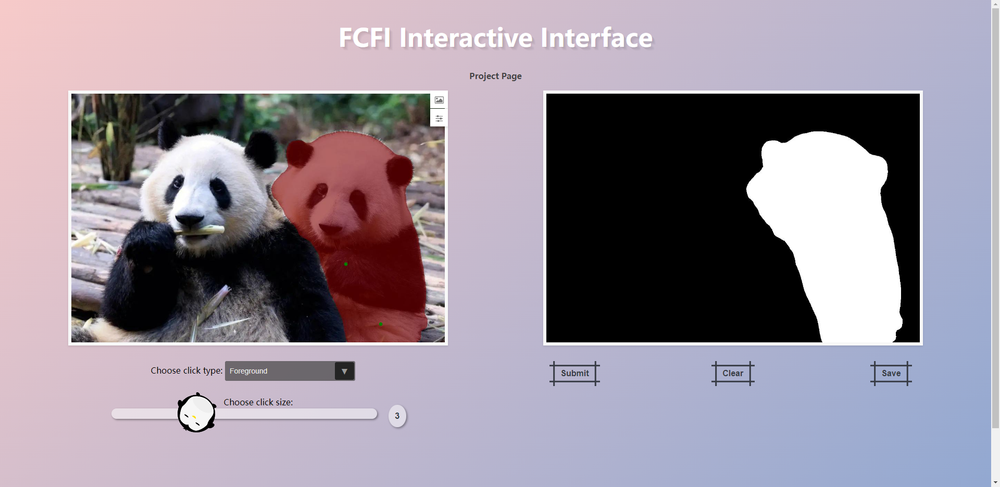

# FCFI
The official implementation of the paper "Focused and Collaborative Feedback Integration for Interactive Image Segmentation" in CVPR2023.

[[arXiv]](https://arxiv.org/pdf/2303.11880.pdf)
[[Paper]](https://openaccess.thecvf.com/content/CVPR2023/papers/Wei_Focused_and_Collaborative_Feedback_Integration_for_Interactive_Image_Segmentation_CVPR_2023_paper.pdf)
[[Poster]](https://drive.google.com/file/d/1XtcdRsAOvZrB7kZz9syOLGpTG-hxdGWA/view)
[[Video]](https://www.youtube.com/watch?v=jotYi4Sho0Q)

## Introduction
<div align=center></div>

**Abstract.** Interactive image segmentation aims at obtaining a segmentation mask for an image using simple user annotations. During each round of interaction, the segmentation result from the previous round serves as feedback to guide the user's annotation and provides dense prior information for the segmentation model, effectively acting as a bridge between interactions. Existing methods overlook the importance of feedback or simply concatenate it with the original input, leading to underutilization of feedback and an increase in the number of required annotations. To address this, we propose an approach called Focused and Collaborative Feedback Integration (FCFI) to fully exploit the feedback for click-based interactive image segmentation. FCFI first focuses on a local area around the new click and corrects the feedback based on the similarities of high-level features. It then alternately and collaboratively updates the feedback and deep features to integrate the feedback into the features. The efficacy and efficiency of FCFI were validated on four benchmarks, namely GrabCut, Berkeley, SBD, and DAVIS. Experimental results show that FCFI achieved new state-of-the-art performance with less computational overhead than previous methods.

## Setup
### Requirements
This work was built using Python 3.8 and relies on PyTorch 1.10.0. The following command installs all necessary packages:

```
pip install -r requirements.txt
```

### Datasets
We trained our models on SBD for the ResNet-101 backbone and on COCO+LVIS for the HRNet18s and HRNet18 backbones.

#### Training Datasets
| Dataset   | Description                             | Download Link                        |
|:---------:|----------------------------------------------|:------------------------------------:|
| SBD       |  8498 images with 20172 instances for (train)<br>2857 images with 6671 instances for (test) |[Official site][SBD]|
| COCO+LVIS |  99k images with 1.5M instances (train) |  [Original LVIS images][LVIS] + <br> [combined annotations][COCOLVIS_annotation] |

#### Evaluation Datasets
| Dataset  | Description                            | Download Link                   |
|:--------:|----------------------------------------|:-------------------------------:|
| GrabCut  | 50 images with one object each (test)  | [GrabCut.zip (11 MB)][GrabCut]  |
| Berkeley | 96 images with 100 instances (test)    | [Berkeley.zip (7 MB)][Berkeley] |
| DAVIS    | 345 images with one object each (test) | [DAVIS.zip (43 MB)][DAVIS]      |

[MSCOCO]: https://cocodataset.org/#download
[LVIS]: https://www.lvisdataset.org/dataset
[SBD]: http://home.bharathh.info/pubs/codes/SBD/download.html
[GrabCut]: https://github.com/saic-vul/fbrs_interactive_segmentation/releases/download/v1.0/GrabCut.zip
[Berkeley]: https://github.com/saic-vul/fbrs_interactive_segmentation/releases/download/v1.0/Berkeley.zip
[DAVIS]: https://github.com/saic-vul/fbrs_interactive_segmentation/releases/download/v1.0/DAVIS.zip
[COCOLVIS_annotation]: https://github.com/saic-vul/ritm_interactive_segmentation/releases/download/v1.0/cocolvis_annotation.tar.gz

### Pre-Trained Models
#### For Training

[hrnetv2_w18_imagenet_pretrained.pth](https://onedrive.live.com/?authkey=%21AMkPimlmClRvmpw&id=F7FD0B7F26543CEB%21112&cid=F7FD0B7F26543CEB&parId=root&parQt=sharedby&o=OneUp)

#### For Interactive Segmentation
<table>
  <thead align="center">
    <tr>
      <th rowspan="2">Model</th>
      <th rowspan="2">Training</span><br>Set</span></th>
      <th colspan="2">GrabCut</th>
      <th>Berkeley</th>
      <th colspan="2">SBD</th>    
      <th colspan="2">DAVIS</th>
    </tr>
    <tr>
      <td>NoC<br>@85%</td>
      <td>NoC<br>@90%</td>
      <td>NoC<br>@90%</td>
      <td>NoC<br>@85%</td>
      <td>NoC<br>@90%</td>
      <td>NoC<br>@85%</td>
      <td>NoC<br>@90%</td>
    </tr>
  </thead>
  <tbody align="center">
    <tr>
      <td align="left"><a href="https://drive.google.com/u/0/uc?id=1bxfaDRZAv7qNfHZXtVeNken2ndpFJ7BF&export=download">ResNet-101<br>(224 MB)</a></td>
      <td rowspan="1">SBD</td>
      <td>1.64</td>
      <td>1.80</td>
      <td>2.83</td>
      <td>3.26</td>
      <td>5.36</td>
      <td>4.75</td>
      <td>6.46</td>
    </tr>
    <tr>
      <td align="left"><a href="https://drive.google.com/u/0/uc?id=1RzUKXWIydewf6qZy48HyLoU21arOVZg2&export=download">HRNet18s<br>(39.5 MB)</a></td>
      <td rowspan="4">COCO+<br>LVIS</td>
      <td>1.42</td>
      <td>1.68</td>
      <td>2.03</td>
      <td>3.64</td>
      <td>5.92</td>
      <td>3.89</td>
      <td>5.13</td>
    </tr>
  </tbody>
</table>

## Training
We provide the scripts for training our models.

For each experiment, a separate folder is created for saving Tensorboard logs, text logs, visualization and checkpoints. You can specify another path in the `./configs/train/config.yml` (see the `EXPS_PATH` variable).

You can also specify other paths for the training datasets in the `./configs/train/config.yml`.

You can start training using the following commands:

```
# Train DeepLabV3+ with ResNet-101 as the backbone
sh scripts/train_r101.sh

# Train HRNet+OCR with HRNet-18s as the backbone
sh scripts/train_h18s.sh
```

## Evaluation
We provide the scripts to evaluate our models on four benchmarks: GrabCut, Berkeley, SBD, and DAVIS. 

To evaluate a model, you should download its corresponding checkpoint and specify the path of the checkpoint in the script (see the `--resume-path` variable). You can specify the paths of the evaluation datasets in the configuration files in the `./configs/val` folder.

```
# Evaluate DeepLabV3+ with ResNet-101 as the backbone
sh scripts/test_r101.sh

# Evaluate HRNet+OCR with HRNet-18s as the backbone
sh scripts/test_h18s.sh
```

If you want to obtain the resulting segmentation masks, add `--vis-preds` in the script. If you want to display annotated clicks on the segmentation masks, add `--vis-points` in the script.


## Interactive Demo
<div align=center></div>
We provide an interactive demo. Feel free to explore it using the following command:

```
sh scripts/demo.sh
```

We would like to extend our special thanks to the following contributors:
- [@xzwthu](https://github.com/xzwthu) for building the initial framework of the demo.
- [@ironheads](https://github.com/ironheads) for correcting the coordinates of the annotated clicks on the webpage canvas.

## Citation
If you find FCFI useful in your research, please cite our paper:

```bibtex
@InProceedings{Wei_2023_CVPR,
    author    = {Wei, Qiaoqiao and Zhang, Hui and Yong, Jun-Hai},
    title     = {Focused and Collaborative Feedback Integration for Interactive Image Segmentation},
    booktitle = {Proceedings of the IEEE/CVF Conference on Computer Vision and Pattern Recognition (CVPR)},
    month     = {June},
    year      = {2023},
    pages     = {18643-18652}
}
```
